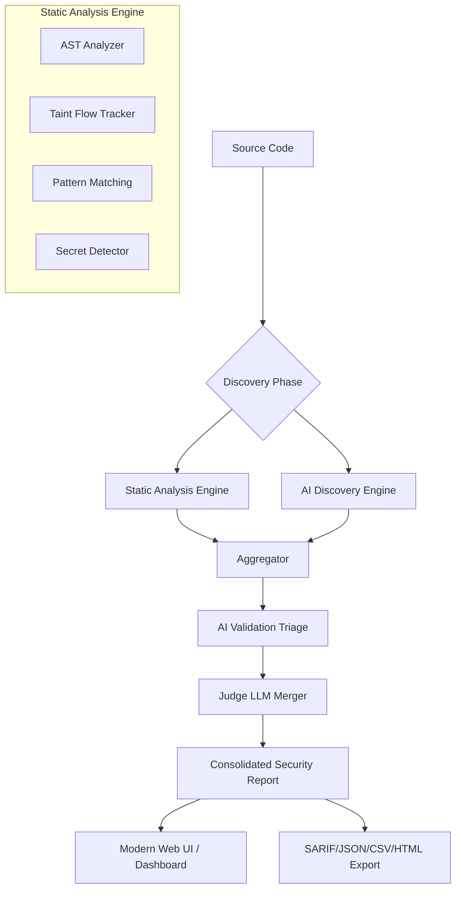

# 🛡️ SentryQ

<div align="center">
  <p><strong>Next-Gen AI-Orchestrated Security Analysis Platform</strong></p>
  <p><i>A high-performance, local-first security tool designed for elite engineering teams. Powered by Go and AI.</i></p>

  [](https://golang.org)
  [](https://react.dev)
  [](https://ollama.com)
</div>

<hr/>

SentryQ transforms security scanning from simple pattern matching into **Intelligent Orchestration**. It runs your codebase through robust static analysis, performs **AI-driven vulnerability validation**, and uses a **"Security Judge" LLM** to deduplicate and validate findings—all running 100% locally on your machine with a pure-Go, production-hardened backend (zero CGO dependencies for seamless cross-platform execution).

## ✨ Core Capabilities & Recent Updates

| 🚀 Feature | 🛠️ Technical Breakdown |
| :--- | :--- |
| **Multi-Engine SAST** | Combines AST-based logic, Taint-flow analysis, and extensive regex patterns across 60+ languages. Thread-safe and free from data races. |
| **AI-Orchestrated Triage** | Uses local LLMs (Ollama/Qwen2.5) or OpenAI endpoints to validate findings via Chain-of-Thought, drastically reducing False Positives with context-aware retry logic. |
| **Deep Taint Tracking** | Analyzes data flow from user-controlled sources to dangerous sinks across variables and functions. |
| **SARIF & Multiple Exports** | Fully compliant SARIF export generation, out-of-the-box HTML reporting, JSON, and CSV exports (Note: PDF rendering has been intentionally decoupled for lightweight performance/security). |
| **UI/UX Resilience** | A dynamic Real-time React/Vite dashboard featuring a fully responsive layout with **Dark/Light mode themes** and automatic sidebar space-management. |

## 🏗️ System Architecture & Parts

SentryQ follows a multi-tier analysis pipeline that prioritizes precision and context.



### The AI Validation Process
Instead of relying solely on baseline static rule matching, SentryQ leverages a **Chain-of-Thought Pipeline**:
1. **Discovery**: The static analyzer flags a raw vulnerability.
2. **Context Compilation**: SentryQ gathers the surrounding code blocks, imports, and variables.
3. **Judge LLM Prompting**: It queries the selected AI model: _"Is this exact context exploitable or is it a safe usage? Explain step-by-step."_
4. **Resolution**: The AI determines True Positives or filters False Positives out, retaining the explanations in the final output.

## 🚀 Installation Guide

SentryQ is designed to compile seamlessly on Linux, macOS, and Windows. 

### Prerequisites

| Platform | Requirements |
| :--- | :--- |
| **Linux (Debian/Ubuntu/Fedora)** | Go (1.24+), Node.js (18+), [Ollama](https://ollama.com) (for local AI) |
| **macOS (Homebrew)** | `brew install go nodejs ollama` |
| **Windows** | Native installers for Go (1.24+), Node.js (18+), Ollama |

*Optional but Recommended:* Run `ollama run qwen2.5-coder:7b` locally to cache SentryQ's default AI model.

### Build Instructions

1.  **Clone the Repository:**
    ```bash
    git clone https://github.com/Gauravjha68535/sentryQ.git
    cd sentryQ
    ```

2.  **Initialize Configuration:**
    Creating a local settings file is essential for configuring AI providers and custom endpoints.
    ```bash
    cp .sentryq-settings.json.example .sentryq-settings.json
    ```

3.  **Compile & Build:**
    Our automated scripts bundle the React Vite frontend and compile the Go backend safely (`CGO_ENABLED=0` enforced automatically).

    - **Linux/macOS:**
      ```bash
      chmod +x build.sh
      ./build.sh
      ```
    - **Windows:**
      ```batch
      .\build.bat
      ```

4.  **Verify Setup:**
    Check for the compiled `sentryq` executable binary in the root directory.

## 🏁 Usage Guide

SentryQ supports both a high-fidelity **Web Application Dashboard** and an automated **Headless CLI**.

### 🔗 Interactive Web Dashboard
Run the primary dashboard for deep triaging with Dark/Light theme support.

```bash
# Start the API and UI server on default port 5336
./sentryq
```
Navigate to **`http://localhost:5336`** in your browser. Click **"New Scan"** and define the target directory.

### 🐚 Headless / Pipeline CLI
Use the CLI to bypass the UI for rapid continuous integration pipelines.
```bash
# Execute an immediate static scan against a repository
./sentryq /path/to/my-repo

# Bind backend to a custom port
./sentryq -port 8080

# Specify a remote Ollama server manually
./sentryq -ollama-host "192.168.1.10:11434"
```
*Note: CLI scans default to pure-static mode for speed. Enable AI validation inside the Dashboard execution.*

## ⚙️ CI/CD Integration (GitHub Actions)

Since SentryQ outputs standard SARIF files effortlessly, you can incorporate it straight into your GitHub Security tab.

Create `.github/workflows/sentryq-scan.yml`:
```yaml
name: "SentryQ Security Scan"
on:
  push:
    branches: [ "main" ]
  pull_request:
    branches: [ "main" ]

jobs:
  sentryq:
    runs-on: ubuntu-latest
    steps:
    - name: Checkout repository
      uses: actions/checkout@v4

    - name: Set up Go
      uses: actions/setup-go@v5
      with:
        go-version: '1.24'

    - name: Build SentryQ
      run: |
        git clone https://github.com/Gauravjha68535/sentryQ.git /tmp/sentryQ
        cd /tmp/sentryQ && sh build.sh
        
    - name: Run SentryQ Headless Scan
      run: |
        /tmp/sentryQ/sentryq ./
        # Your custom logic to parse the SARIF output dynamically goes here
```

## 💻 Configuration Deep Dive & Environment Variables

Configure the engine using `.sentryq-settings.json` located in the root of the project or override via CLI/Env Variables:

| Field | Description | Default |
| :--- | :--- | :--- |
| `ollama_host` | Hostname and port of your local or remote Ollama server. | `localhost:11434` |
| `default_model` | The default LLM used for Chain-of-Thought validation. | `qwen2.5-coder:7b` |
| `ai_provider` | Choice of AI engine (`ollama`, `openai`, or `custom`). | `ollama` |
| `custom_api_url` | Full endpoint URI for custom AI providers (vLLM, TGI, etc). | `http://localhost:5005` |
| `custom_api_key` | API Key for your chosen provider. | `YOUR_API_KEY_HERE` |

**Supported Environment Variables:**
- `PORT`: Overrides the default port `5336` (e.g. `PORT=8080 ./sentryq`).
- `OLLAMA_HOST`: Sets the target Ollama instance (e.g. `OLLAMA_HOST=192.168.1.5::11434 ./sentryq`).

### Custom Static Rules
Place custom YAML detection patterns into the `rules/` directory to automatically weave them into the analysis engine seamlessly. Here is an anatomy of a custom rule:

```yaml
- id: hardcoded-jwt-secret
  languages: [javascript, typescript, python, go]
  patterns:
    - regex: '(?i)(jwt_secret|jwt_key|secret_key)\s*=\s*["\'][a-zA-Z0-9_\-\.]{10,}["\']'
  severity: critical
  description: "Detected a dangerously hardcoded JWT Token Secret"
  remediation: "Use environment variables (e.g., process.env.JWT_SECRET) to load sensitive keys"
  cwe: "CWE-798"
  owasp: "A07:2021"
```

## 📈 Recent Technical Highlights
- **Production Code Hardening**: Consolidated utilities (e.g. `truncating strings`), removed duplicate logical flows, fixed data races, and established CGO-less builds.
- **Reporting Improvements**: Validated strict adoption of standard **SARIF** formats for smooth CI/CD integration; preserved robust HTML generation whilst experimental PDF generator code was cleaned from the dashboard.
- **UI Enhancements**: Resolved sidebar overflow mechanics and introduced contrast-accessible Light/Dark mode transitions on the React Dashboard.

## 🤝 Contributing & Development
- **Core Engine**: `scanner/` and `cmd/scanner/`
- **AI Triage Validation**: `ai/`
- **UI & Reporting**: Web assets in `web/` and generator logic in `reporter/` (HTML, CSV, SARIF).

**Running the Frontend independently for development:**
```bash
cd web
npm install
npm run dev
```

**Quality Assurance**: Run `go test ./...` across the directory to validate components against potential regressions.

## 📜 License
© 2026 SentryQ Security Team.