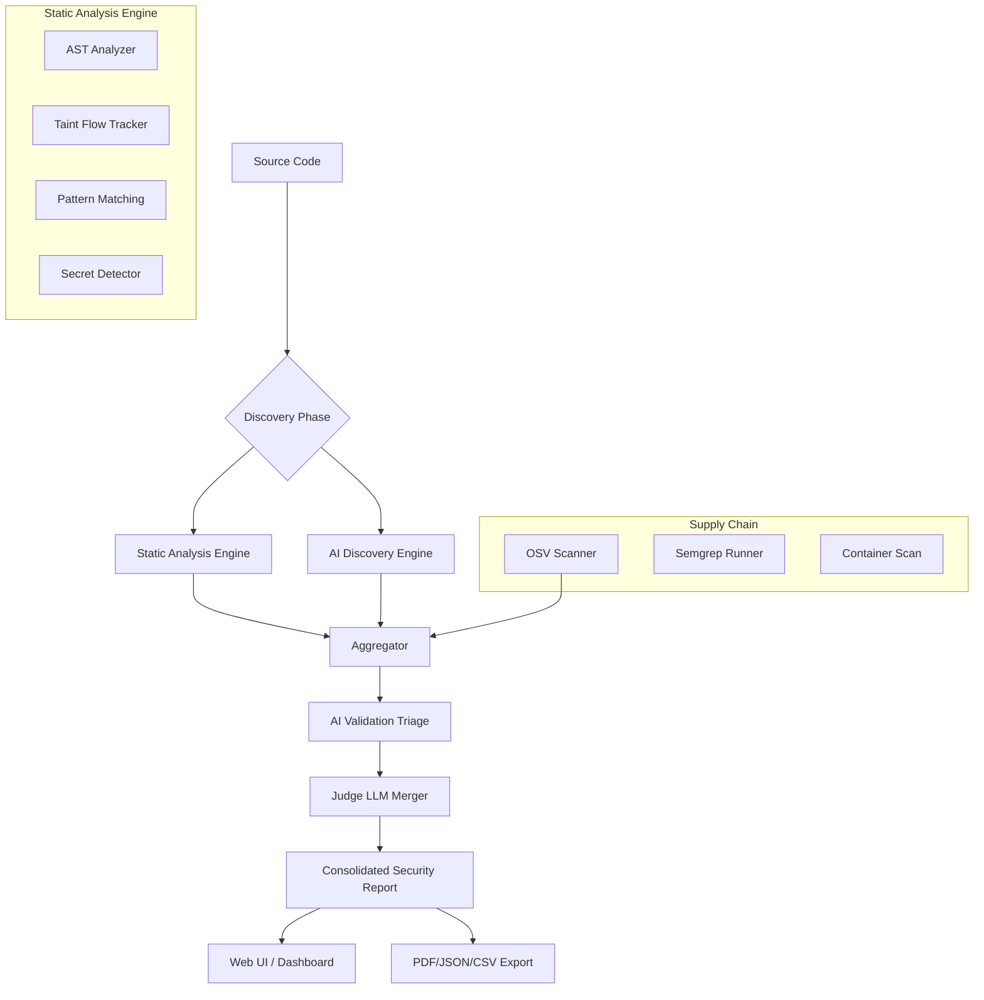

# 🛡️ SentryQ

<div align="center">
  <p><strong>Next-Gen AI-Orchestrated Security Analysis Platform</strong></p>
  <p><i>A high-performance, local-first security tool designed for elite engineering teams. Powered by Go and AI.</i></p>

  [](https://golang.org)
  [](https://react.dev)
  [](https://ollama.com)
</div>

<hr/>

SentryQ transforms security scanning from simple pattern matching into **Intelligent Orchestration**. It runs your codebase through **12,400+ static rules** across 60+ languages, performs **AI-driven vulnerability discovery**, and uses a **"Security Judge" LLM** to deduplicate and validate findings—all running 100% locally on your machine.

## ✨ Core Capabilities

| 🚀 Feature | 🛠️ Technical Breakdown |
| :--- | :--- |
| **Multi-Engine SAST** | Combines AST-based logic, Taint-flow analysis, and 12,000+ regex patterns across 60+ languages. |
| **AI-Orchestrated Triage** | Uses local LLMs (Ollama/Qwen2.5) or OpenAI endpoints to validate findings via Chain-of-Thought, drastically reducing False Positives. |
| **Deep Taint Tracking** | Analyzes data flow from user-controlled sources to dangerous sinks across variables and functions. |
| **Threat Intel Enrichment** | Findings are mapped against **MITRE ATT&CK**, **CISA KEV**, and **EPSS** threat intelligence databases. |
| **Supply Chain & SCA** | Seamless integrations with Google **OSV-Scanner** and **Semgrep** for dependency audits and framework vulnerabilities. |
| **Decision Judge Model** | A specialized "Judge Engine" compares static findings and AI heuristics to produce a unified, trusted security report. |
| **Rich Reporting & Dashboard**| Real-time web UI dashboard (React/Vite), plus PDF, CSV, and HTML report exports. |

## 🏗️ System Architecture

SentryQ follows a multi-tier analysis pipeline that prioritizes precision and context. It is fully cross-platform (Windows, macOS, Linux).



## 🚀 Quick Start

### 1. Prerequisites (Platform Specific)

#### 🐧 Linux / 🍏 macOS
```bash
# Ensure Go (1.24+) and Node.js (18+) are installed
# Install Ollama from ollama.com and run the default model
ollama run qwen2.5-coder:7b

# Install External Scanners (Required for SCA and Framework Audits)
go install github.com/google/osv-scanner/v2/cmd/osv-scanner@v2
pip3 install semgrep
```

#### 🪟 Windows
1. Install **[Go](https://go.dev/dl/)** (1.24+) and **[Node.js](https://nodejs.org/)** (18+).
2. Install **[Ollama](https://ollama.com/)** and run `ollama run qwen2.5-coder:7b`.
3. Install Python and set up Semgrep: `pip install semgrep`.
4. Install OSV-Scanner: `go install github.com/google/osv-scanner/v2/cmd/osv-scanner@v2`.

### 2. Build & Deploy

#### 🐧 Linux / 🍏 macOS
```bash
chmod +x build.sh
./build.sh
./sentryq
```

#### 🪟 Windows (Native CMD/PowerShell)
```batch
.\build.bat
.\sentryq.exe
```

Access the real-time Triage Dashboard at: **`http://localhost:5336`**

## 💻 CLI Usage & Configuration

SentryQ can be run directly from the command line for CI/CD integration or quick local scans.

### Common Flags

| Flag | Description | Default |
| :--- | :--- | :--- |
| `-port` | Web Dashboard listening port | `5336` |
| `-ollama-host` | Specify a remote Ollama instance (e.g. `192.168.1.10:11434`) | `localhost:11434` |
| `[target]` | Pass a target directory for an immediate blocking CLI scan | `None` |

**Example:**
```bash
# Start Web Dashboard
./sentryq

# Immediate CLI Scan on local directory
./sentryq ./my-project-dir

# Connect to Remote Ollama
./sentryq -ollama-host "172.29.190.139:11434" ./my-project-dir
```

### Advanced AI Configuration
Edit `.sentryq-settings.json` in your workspace to configure custom OpenAI endpoints, switch active AI providers, or change model preferences.

## 🤝 Contributing & Extension

SentryQ is designed to be highly modular and extensible.
- **Core Engine**: The primary scanner logic is located in `scanner/` and `cmd/scanner/`.
- **AI Triage**: Explore the AI processing pipeline in `ai/`.
- **Rules Mapping**: Add your custom generic or framework-specific YAML rules to the `rules/` directory.
- **Frontend Panel**: The React/Vite frontend UI is situated in `web/` and served via websocket hubs in the backend.

**Run tests via:**
```bash
go test ./...
```

## 📜 License

© 2026 SentryQ Security Team.